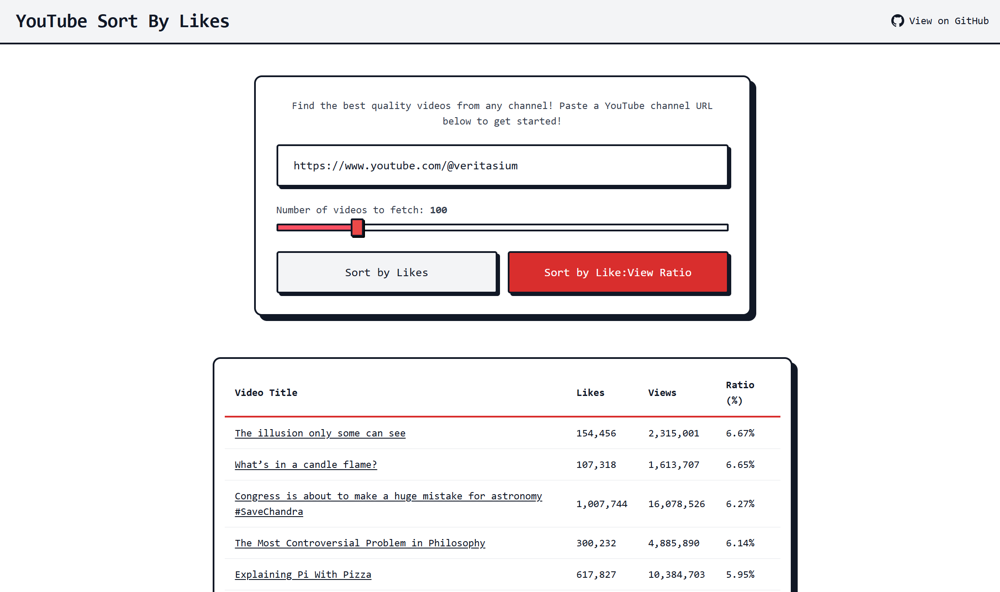

# YouTubeSortByLikes

<p align="center"><i>Find the best quality videos from any channel! Like:View ratio is the best signal.</i></p>

<p align="center">
  
</p>


## Self Hosting 

Create a .env file in the root of the project and add the following:

```
YOUTUBE_API_KEY=get-your-own-key-from-google-cloud-console
```

Then I recommend hosting with Vercel, it'll take care of everything for you.


